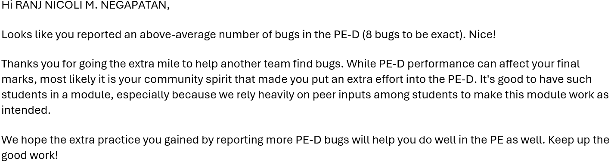

# Ranj Nicoli M. Negapatan - Project Portfolio Page

### Project AeroCade

AeroCade is an In-Flight Entertainment app designed to keep users entertained during travels,
optimized for use via a Command Line Interface (CLI) while still having the core functionalities and features.

Provided below are my contributions to the project.

**`TTT` Class**
The `TTT` class has a grand total of 9 methods, each of which are integral to the function of the TTT game.
Pretty much all of it was written by me, even the UI elements, save for some small enhancements here and there. `readTTMove` was written by Tahsin, and is accordingly
within her Parser class file.
* `printBoard` prints the current state of the `TTT` `board`.
* `lineCheckComputer` and `lineCheckPlayer` are line algorithms that determine the best move for the `hard` computer to make within the line
* `checkWinner` checks the current board state and outputs the winner.
* `computerBestMove` combines `lineCheckComputer` and `lineCheckPlayer` and applies them to the whole `board`
* `TTTLogic` runs the game's logic, determining board placements mainly.
* `runGame` is an override from the `Game` class, and runs the entire TTT game, including the inputs from the player and outputs from the computer onto the CLI.

**Code contributed**: [RepoSense link](https://nus-cs2113-ay2324s2.github.io/tp-dashboard/?search=nicknamenic&breakdown=true&sort=groupTitle%20dsc&sortWithin=title&since=2024-02-23&timeframe=commit&mergegroup=&groupSelect=groupByRepos&checkedFileTypes=docs~functional-code~test-code~other)

**Enhancements to existing features:**
* Provided an `easy` and `hard` mode for `TTT`.
* Made an algorithm so foolproof that it is impossible to beat the `hard`, the best case scenario ending in a draw.

**Contributions to Developer Guide:**
* Added documentation of the `TTT` Class.
* Added implementation of `TTT` Class methods / features.

**Contributions to User Guide**
* Added input instructions for `TTT`.

**Contributions beyond the project team:**
* Reported a decent number of bugs during the demo PE!
  * 
